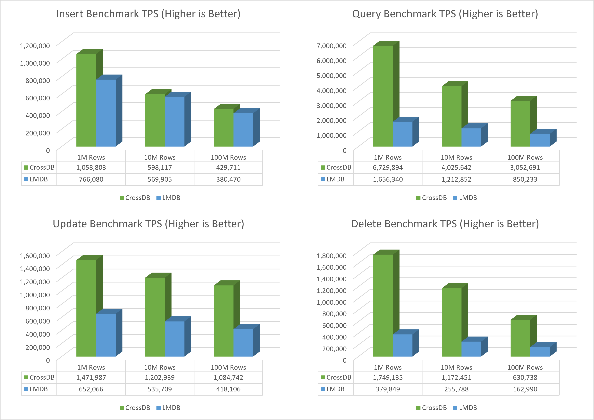
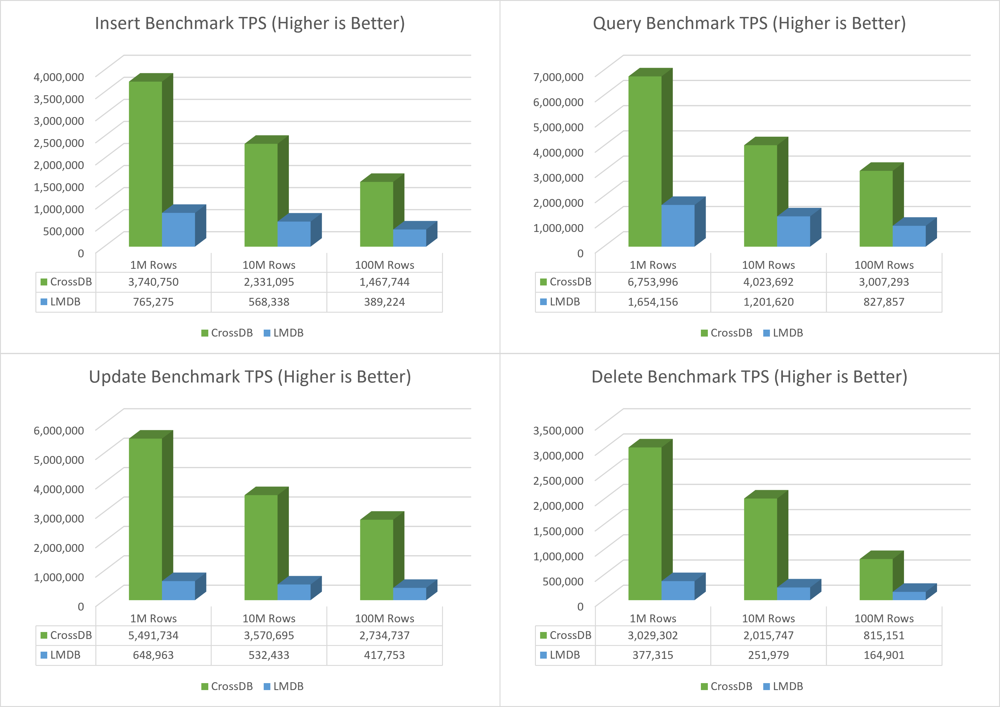

# CrossDB vs. LMDB Benchmark

Test tool: [CrossBench](../../../docs/reference/crossbench)  

DB Driver: [LMDB](https://github.com/crossdb-org/CrossBench/blob/main/lmdb-bench.c) [CrossDB](https://github.com/crossdb-org/CrossBench/blob/main/crossdb-bench.c) 

Test Config: Random Access, Single Thread, Bind CPU Core

## Test Server
```
CPU			: Intel(R) Xeon(R) Gold 5318Y CPU @ 2.10GHz	cache size 36864 KB
HDD			: DELL PERC H755 Front SCSI Disk
OS			: Ubuntu 20.04
LMDB		: v0.9.24
CrossDB		: v0.5.0
```

<!--
cat /proc/cpuinfo
sudo lshw -class disk
-->

## On-Disk Database Test
-------------------------------------------------------------------------------

**Test Script**

=== "CrossDB"
	```
	loop="1 2 3"
	./crossdb-bench.bin -H -r 0
	for i in $loop; do ./crossdb-bench.bin -s d -i 1k   -q 30m -u 1m  -Q -H -c $cpu; done
	for i in $loop; do ./crossdb-bench.bin -s d -i 10k  -q 30m -u 1m  -Q -H -c $cpu; done
	for i in $loop; do ./crossdb-bench.bin -s d -i 100k -q 20m -u 1m  -Q -H -c $cpu; done
	for i in $loop; do ./crossdb-bench.bin -s d -i 1m   -q 10m -u 1m  -Q -H -c $cpu; done
	for i in $loop; do ./crossdb-bench.bin -s d -i 10m  -q 5m  -u 1m  -Q -H -c $cpu; done
	for i in $loop; do ./crossdb-bench.bin -s d -i 100m -q 5m  -u 1m  -Q -H -c $cpu; done
	```
=== "LMDB"
	```
	loop="1 2 3"
	./lmdb-bench.bin -H -r 0
	for i in $loop; do ./lmdb-bench.bin -s d -i 1k   -q 10m -u 5m -Q -H -c $cpu; done
	for i in $loop; do ./lmdb-bench.bin -s d -i 10k  -q 10m -u 5m -Q -H -c $cpu; done
	for i in $loop; do ./lmdb-bench.bin -s d -i 100k -q 10m -u 5m -Q -H -c $cpu; done
	for i in $loop; do ./lmdb-bench.bin -s d -i 1m   -q 5m  -u 5m -Q -H -c $cpu; done
	for i in $loop; do ./lmdb-bench.bin -s d -i 10m  -q 2m  -u 2m -Q -H -c $cpu; done
	for i in $loop; do ./lmdb-bench.bin -s d -i 100m -q 1m  -u 1m -Q -H -c $cpu; done
	```

**Small Data Set Test**
<figure class="cdb-figure">
	
</figure>

**Large Data Set Test**
<figure class="cdb-figure">
	
</figure>


## On-RamDisk Database Test
-------------------------------------------------------------------------------

**Test Script**
=== "CrossDB"
	```
	loop="1 2 3"
	./crossdb-bench.bin -H -r 0
	for i in $loop; do ./crossdb-bench.bin -s r -i 1k   -q 40m -u 30m -Q -H -c $cpu; done
	for i in $loop; do ./crossdb-bench.bin -s r -i 10k  -q 40m -u 30m -Q -H -c $cpu; done
	for i in $loop; do ./crossdb-bench.bin -s r -i 100k -q 40m -u 30m -Q -H -c $cpu; done
	for i in $loop; do ./crossdb-bench.bin -s r -i 1m   -q 10m -u 10m -Q -H -c $cpu; done
	for i in $loop; do ./crossdb-bench.bin -s r -i 10m  -q 10m -u 10m -Q -H -c $cpu; done
	for i in $loop; do ./crossdb-bench.bin -s r -i 100m -q 10m -u 10m -Q -H -c $cpu; done
	```
=== "LMDB"
	```
	loop="1 2 3"
	./lmdb-bench.bin -H -r 0
	for i in $loop; do ./lmdb-bench.bin -s r -i 1k   -q 10m -u 5m  -Q -H -c $cpu; done
	for i in $loop; do ./lmdb-bench.bin -s r -i 10k  -q 10m -u 5m  -Q -H -c $cpu; done
	for i in $loop; do ./lmdb-bench.bin -s r -i 100k -q 10m -u 5m  -Q -H -c $cpu; done
	for i in $loop; do ./lmdb-bench.bin -s r -i 1m   -q 5m  -u 5m  -Q -H -c $cpu; done
	for i in $loop; do ./lmdb-bench.bin -s r -i 10m  -q 2m  -u 2m  -Q -H -c $cpu; done
	for i in $loop; do ./lmdb-bench.bin -s r -i 100m -q 1m  -u 1m  -Q -H -c $cpu; done
	```

**Small Data Set Test**
<figure class="cdb-figure">
	
</figure>

**Large Data Set Test**
<figure class="cdb-figure">
	
</figure>
