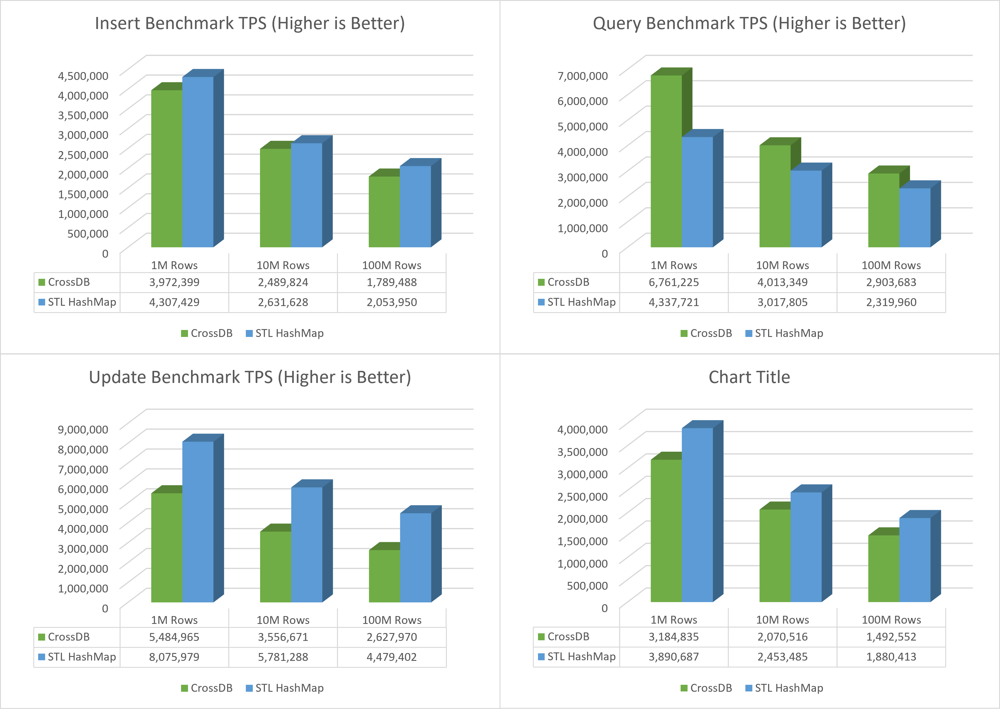

# CrossDB vs STL Hashmap Benchmark

Test tool: [CrossBench](../../../docs/reference/crossbench)  

DB Driver: [STLHashmap](https://github.com/crossdb-org/CrossBench/blob/main/stlhmap-bench.c) [CrossDB](https://github.com/crossdb-org/CrossBench/blob/main/crossdb-bench.c) 

Test Config: Random Access, Single Thread, Bind CPU Core, To make test fair, STL map uses read-write lock as CrossDB is thread-safe with read-write lock also.

>**Note**
> Official STL Hashmap is **unordered_map**, which is the fastest data container in CPP. This test is to show how close CrossDB performance to STL Hashmap and CrossDB query can be faster than Hashmap in large data set test.

## Test Server
```
CPU			: Intel(R) Xeon(R) Gold 5318Y CPU @ 2.10GHz	cache size 36864 KB
HDD			: DELL PERC H755 Front SCSI Disk
OS			: Ubuntu 20.04
STL			: GCC v10.2.1
CrossDB		: v0.5.0
```

<!--
cat /proc/cpuinfo
sudo lshw -class disk
-->

## In-Memory Database Benchmark
-------------------------------------------------------------------------------

**Test Script**

=== "CrossDB"
	```
	loop="1 2 3"
	./crossdb-bench.bin -H -r 0
	for i in $loop; do ./crossdb-bench.bin -s m -i 1k   -q 40m -u 30m -Q -H -c $cpu; done
	for i in $loop; do ./crossdb-bench.bin -s m -i 10k  -q 40m -u 30m -Q -H -c $cpu; done
	for i in $loop; do ./crossdb-bench.bin -s m -i 100k -q 40m -u 30m -Q -H -c $cpu; done
	for i in $loop; do ./crossdb-bench.bin -s m -i 1m   -q 10m -u 10m -Q -H -c $cpu; done
	for i in $loop; do ./crossdb-bench.bin -s m -i 10m  -q 10m -u 10m -Q -H -c $cpu; done
	for i in $loop; do ./crossdb-bench.bin -s m -i 100m -q 10m -u 10m -Q -H -c $cpu; done
	```

=== "STL Hashmap"
	```
	loop="1 2 3"
	./stlhmap-bench.bin -H -r 0
	for i in $loop; do ./stlhmap-bench.bin -s m -i 1k   -q 60m -u 60m -Q -H -c $cpu; done
	for i in $loop; do ./stlhmap-bench.bin -s m -i 10k  -q 60m -u 60m -Q -H -c $cpu; done
	for i in $loop; do ./stlhmap-bench.bin -s m -i 100k -q 30m -u 40m -Q -H -c $cpu; done
	for i in $loop; do ./stlhmap-bench.bin -s m -i 1m   -q 10m -u 10m -Q -H -c $cpu; done
	for i in $loop; do ./stlhmap-bench.bin -s m -i 10m  -q 10m -u 10m -Q -H -c $cpu; done
	for i in $loop; do ./stlhmap-bench.bin -s m -i 100m -q 10m -u 10m -Q -H -c $cpu; done
	```

**Small Data Set Test**
<figure class="cdb-figure">
	
</figure>

**Large Data Set Test**
<figure class="cdb-figure">
	
</figure>
