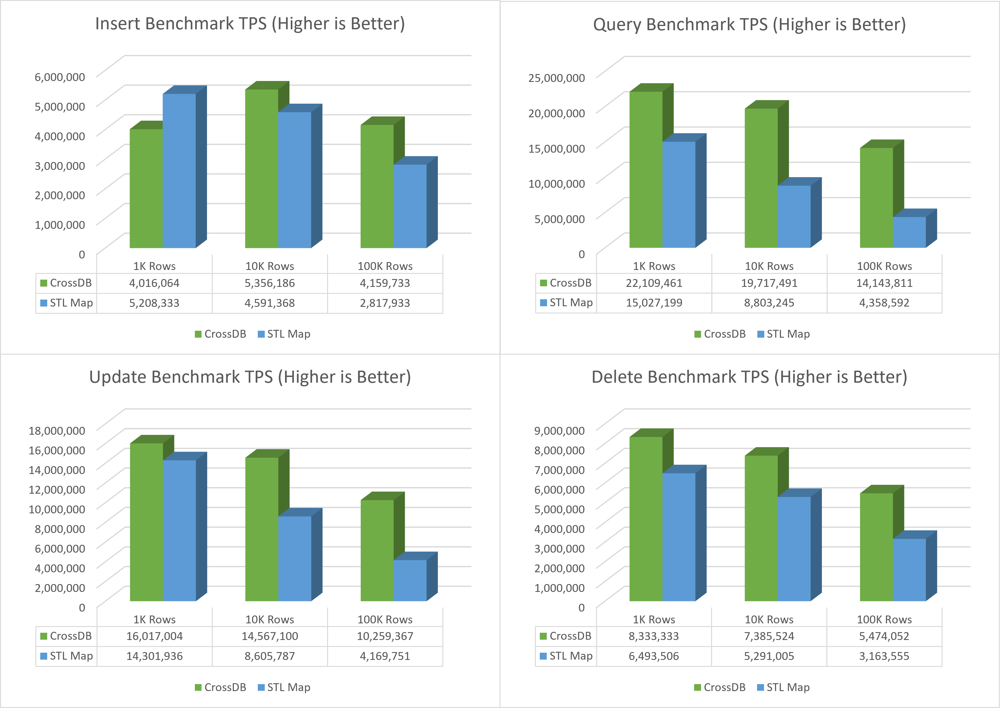
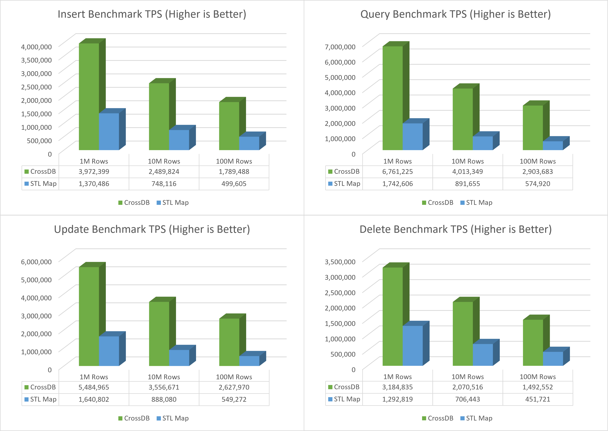

# CrossDB vs. STL Map and Hashmap Benchmark

Test tool: [CrossBench](../../../docs/reference/crossbench)  

DB Driver: [STLMap](https://github.com/crossdb-org/CrossBench/blob/main/stlmap-bench.c) [STLHashmap](https://github.com/crossdb-org/CrossBench/blob/main/stlhmap-bench.c) [CrossDB](https://github.com/crossdb-org/CrossBench/blob/main/crossdb-bench.c) 

Test Config: Random Access, Single Thread, Bind CPU Core

## Test Server
```
CPU			: Intel(R) Xeon(R) Gold 5318Y CPU @ 2.10GHz	cache size 36864 KB
HDD			: DELL PERC H755 Front SCSI Disk
OS			: Ubuntu 20.04
STL			: GCC v10.2.1
CrossDB		: v0.5.0
```

<!--
cat /proc/cpuinfo
sudo lshw -class disk
-->

## In-Memory Database Test
-------------------------------------------------------------------------------

**Test Script**

=== "CrossDB"
	```
	loop="1 2 3"
	./crossdb-bench.bin -H -r 0
	for i in $loop; do ./crossdb-bench.bin -s m -i 1k   -q 40m -u 30m -Q -H -c $cpu; done
	for i in $loop; do ./crossdb-bench.bin -s m -i 10k  -q 40m -u 30m -Q -H -c $cpu; done
	for i in $loop; do ./crossdb-bench.bin -s m -i 100k -q 40m -u 30m -Q -H -c $cpu; done
	for i in $loop; do ./crossdb-bench.bin -s m -i 1m   -q 10m -u 10m -Q -H -c $cpu; done
	for i in $loop; do ./crossdb-bench.bin -s m -i 10m  -q 10m -u 10m -Q -H -c $cpu; done
	for i in $loop; do ./crossdb-bench.bin -s m -i 100m -q 10m -u 10m -Q -H -c $cpu; done
	```

=== "STL Map"
	```
	loop="1 2 3"
	./stlmap-bench.bin -H -r 0
	for i in $loop; do ./stlmap-bench.bin -s m -i 1k   -q 40m -u 40m -Q -H -c $cpu; done
	for i in $loop; do ./stlmap-bench.bin -s m -i 10k  -q 20m -u 20m -Q -H -c $cpu; done
	for i in $loop; do ./stlmap-bench.bin -s m -i 100k -q 10m -u 10m -Q -H -c $cpu; done
	for i in $loop; do ./stlmap-bench.bin -s m -i 1m   -q 5m  -u 5m  -Q -H -c $cpu; done
	for i in $loop; do ./stlmap-bench.bin -s m -i 10m  -q 2m  -u 2m  -Q -H -c $cpu; done
	for i in $loop; do ./stlmap-bench.bin -s m -i 100m -q 1m  -u 1m  -Q -H -c $cpu; done
	```

=== "STL Hashmap"
	```
	loop="1 2 3"
	./stlhmap-bench.bin -H -r 0
	for i in $loop; do ./stlhmap-bench.bin -s m -i 1k   -q 60m -u 60m -Q -H -c $cpu; done
	for i in $loop; do ./stlhmap-bench.bin -s m -i 10k  -q 60m -u 60m -Q -H -c $cpu; done
	for i in $loop; do ./stlhmap-bench.bin -s m -i 100k -q 30m -u 40m -Q -H -c $cpu; done
	for i in $loop; do ./stlhmap-bench.bin -s m -i 1m   -q 10m -u 10m -Q -H -c $cpu; done
	for i in $loop; do ./stlhmap-bench.bin -s m -i 10m  -q 10m -u 10m -Q -H -c $cpu; done
	for i in $loop; do ./stlhmap-bench.bin -s m -i 100m -q 10m -u 10m -Q -H -c $cpu; done
	```

**Small Data Set Test**
<figure class="cdb-figure">
	
</figure>

**Large Data Set Test**
<figure class="cdb-figure">
	
</figure>

<!--
Insert		| STL Map	| STL HashMap | CrossDB
 ----       | ----      | ----        | ----
1K Rows		| 5,208,333	| 8,547,008	  | 4,016,064
10K Rows	| 4,591,368	| 9,293,680	  | 5,356,186
100K Rows	| 2,817,933	| 5,918,910	  | 4,159,733
1M Rows		| 1,370,486	| 4,307,429	  | 3,972,399
10M Rows	|   748,116	| 2,631,628	  | 2,489,824
100M Rows	|   499,605	| 2,053,950	  | 1,789,488

Query		| STL Map	| STL HashMap | CrossDB
 ----       | ----      | ----        | ----
1K Rows		| 15,027,199| 48,217,752  | 22,109,461
10K Rows	|  8,803,245| 40,067,111  | 19,717,491
100K Rows	|  4,358,592| 14,537,531  | 14,143,811
1M Rows		|  1,742,606|  4,337,721  |  6,761,225
10M Rows	|   891,655	|  3,017,805  |  4,013,349
100M Rows	|   574,920	|  2,319,960  |  2,903,683

Update		| STL Map	| STL HashMap | CrossDB
 ----       | ----      | ----        | ----
1K Rows		| 14,301,936| 38,029,789  | 16,017,004
10K Rows	|  8,605,787| 37,813,531  | 14,567,100
100K Rows	|  4,169,751| 26,214,830  | 10,259,367
1M Rows		|  1,640,802|  8,075,979  |  5,484,965
10M Rows	|    888,080|  5,781,288  |  3,556,671
100M Rows	|    549,272|  4,479,402  |  2,627,970
				
Delete		| STL Map	| STL HashMap | CrossDB
 ----       | ----      | ----        | ----
1K Rows		| 6,493,506	| 18,181,818  | 8,333,333
10K Rows	| 5,291,005	| 14,513,788  | 7,385,524
100K Rows	| 3,163,555	|  9,502,090  | 5,474,052
1M Rows		| 1,292,819	|  3,890,687  | 3,184,835
10M Rows	|  706,443	|  2,453,485  | 2,070,516
100M Rows	|  451,721	|  1,880,413  | 1,492,552
-->